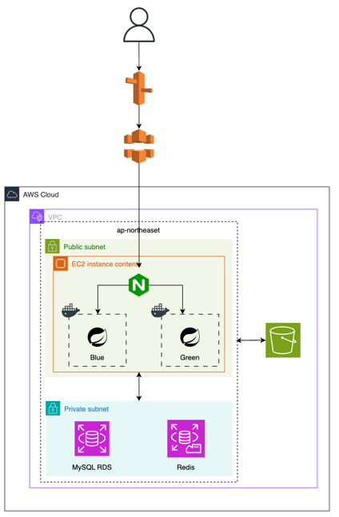

### 설명
- 이 코드는 간단한 연습용이며, 간단한 유저, 게시물로만 작성되었습니다. 

### 전체 아키텍처

- 전반적으로 Clean / Hexagonal Architecture를 따릅니다.  
  `adapter-in (web) → application (service, validator, mapper) → domain (model, repository interface) → adapter-out (persistence, JPA)` 흐름으로 계층을 분리했습니다.

---

### 도메인 모델 / 영속 계층 분리

- `User`, `Post` 도메인은 JPA 어노테이션이 없는 순수 객체로 두고,  
  실제 DB 매핑은 `UserJpaEntity`, `PostJpaEntity`처럼 `adapter.out.persistence` 계층에서만 담당하도록 했습니다.
- 도메인 계층에는 `UserRepository`, `PostRepository` 인터페이스만 두고,  
  구현체(`UserRepositoryImpl`, `PostRepositoryImpl`)는 adapter-out에 두어 인프라 교체와 테스트 용이성을 고려했습니다.

---

### 애플리케이션 계층 (Service / Validator / Mapper)

- 컨트롤러는 요청/응답 DTO(record)만 다루고,  
  비즈니스 로직은 `UserService`, `PostService`에서 처리하도록 분리했습니다.
- `PostValidator`, `UserValidator`를 통해 입력 값과 도메인 제약을 검증하고,  
  서비스 단에서는 “검증이 끝난 도메인 로직”만 다루도록 했습니다.
- 매핑은 MapStruct 등의 Mapper를 통해  
  `Request DTO → Command → Domain → JPA Entity` 흐름으로 정리했습니다.

---

### 예외 및 에러 코드 관리

- `UserNotFoundException`, `PostNotFoundException`, `DuplicateEmailException`, `InvalidUserNameException` 등  
  도메인 전용 예외를 두고, 각 예외는 내부에서 고정된 `ErrorCode`를 사용하도록 설계했습니다.
- Validator와 Repository 구현체에서는 `BusinessException` 대신  
  도메인 전용 예외를 직접 던져, 에러 의미가 명확하게 드러나도록 했습니다.

---

### 일관된 패턴

- User와 Post 모두  
  `Controller → Service → Validator → Domain Repository → Persistence(JPA)`  
  동일한 패턴을 따르도록 맞췄습니다.

### 배포 자동화

### 시스템 아키텍처
